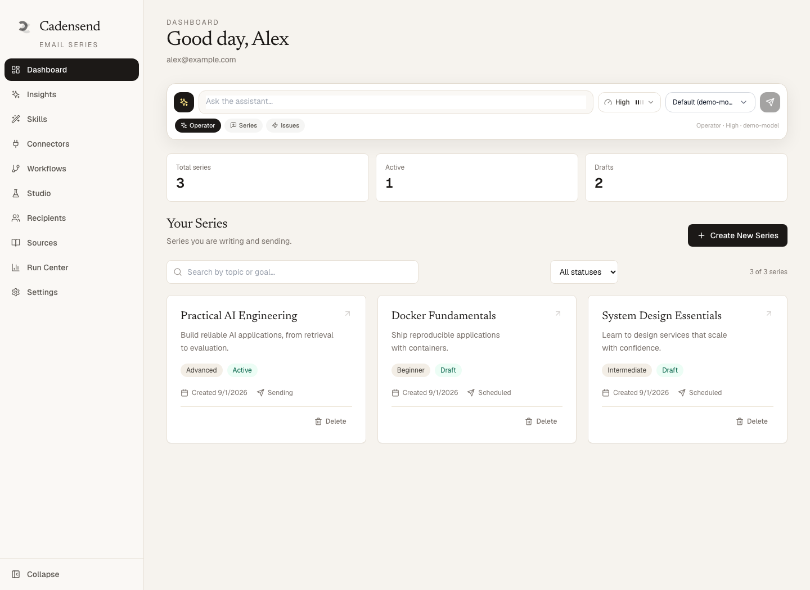
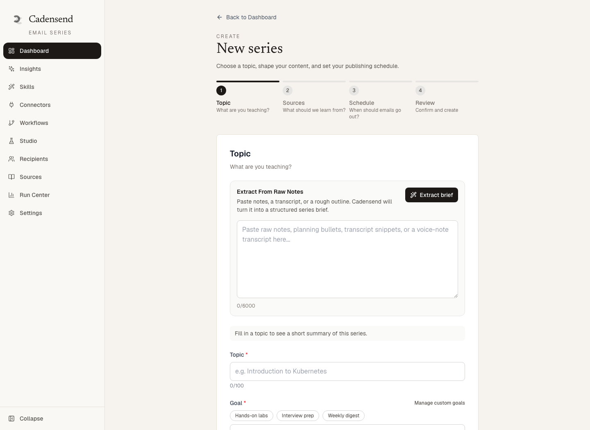
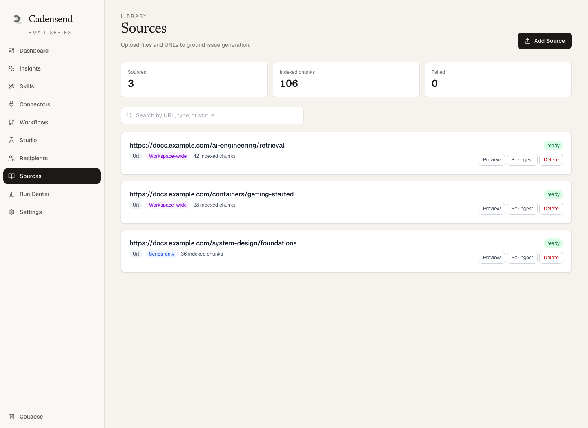
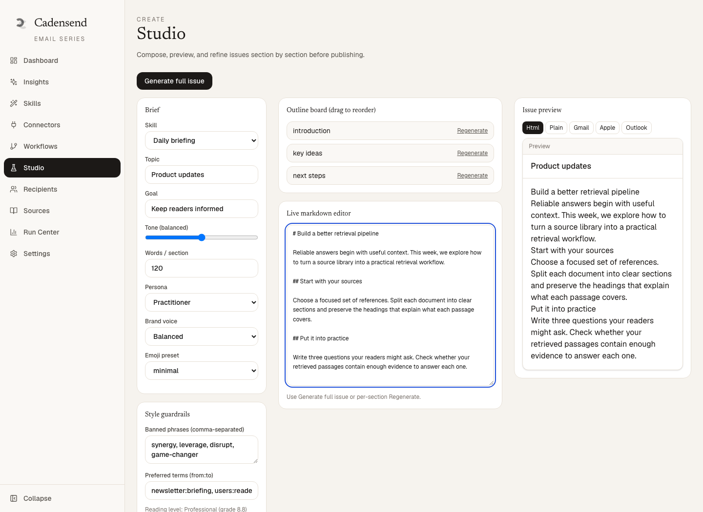
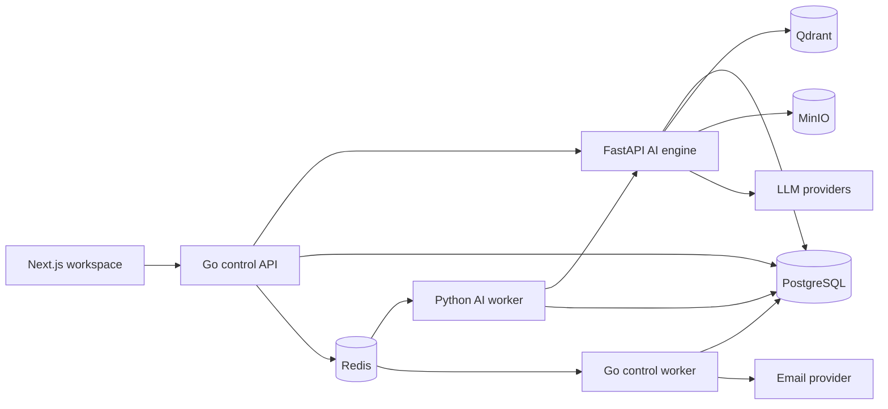

<p align="center">
  
</p>

<h1 align="center">Cadensend</h1>

<p align="center">
  <strong>Turn knowledge into an email series worth opening.</strong><br />
  Plan a curriculum, ground it in your sources, and deliver lessons on a schedule.
</p>

<p align="center">
  <a href="LICENSE"></a>
  
  
  
</p>

<p align="center">
  <a href="#demo">Demo</a> ·
  <a href="#features">Features</a> ·
  <a href="#quick-start">Quick start</a> ·
  <a href="#architecture">Architecture</a> ·
  <a href="#contributing">Contributing</a>
</p>



Cadensend is an open-source workspace for creating and managing AI-assisted learning series and newsletters. Bring a topic and reference material, shape the content in an editorial workspace, then review and schedule issues for your readers.

## Features

| Capability | What you can do |
| --- | --- |
| **AI-assisted planning** | Turn a learning goal into a structured, multi-module curriculum. Use the dashboard assistant or the series creation form. |
| **Source-grounded generation** | Import URLs and files, index them for retrieval, and generate content with citations. Scope sources to a workspace or an individual series. |
| **Editorial control** | Generate, edit, preview, and approve issues. Work with content structure, style preferences, and issue versions. |
| **Content Studio** | Shape outlines, tone, and word targets; edit Markdown and preview the result with readability feedback. |
| **Scheduled delivery** | Manage recipients and send issues through the background scheduler with configurable email providers. |
| **Operational visibility** | Inspect generation runs, review insights, and manage models, connectors, and workflows from the app. |
| **Self-hosted infrastructure** | Run the web app, Go services, Python AI engine, and supporting data stores with Docker Compose. |

## Demo

Screenshots show the current frontend with fictional sample data. They illustrate the interface; model responses and delivery results depend on your configured services.

### Create a learning series

Define the topic, learning goal, and content preferences before generating a plan.



### Build a source library

Keep reference material in one place, inspect indexing status, and control which sources are shared across your workspace.



### Shape content in Studio

Configure the writing brief, organize sections, and work with the editor and preview in one workspace.



## Quick start

### 1. Clone and configure

You need Git, Docker, and Docker Compose v2. AI generation also requires provider credentials; the supplied Compose configuration uses OpenRouter.

```bash
git clone https://github.com/HinterBuild/cadensend.git
cd cadensend
cp .env.example .env
```

Edit `.env` before starting:

| Variable | Purpose |
| --- | --- |
| `OPENROUTER_API_KEY` | Required for generation and embeddings with the default configuration. |
| `DEFAULT_MODEL` | Generation model identifier. Choose a model available to your provider account. |
| `EMBEDDING_MODEL` | Embedding model used to index and retrieve sources. |
| `JWT_SECRET` | Signing secret for user sessions. Replace the development value for shared deployments. |
| `INTERNAL_API_TOKEN` | Authentication between internal services. Replace the development value for shared deployments. |
| `BREVO_API_KEY` | Required when sending email through Brevo. |
| `SMTP_FROM` / `SMTP_FROM_NAME` | Sender address and display name for email delivery. |

See [`.env.example`](.env.example) for the full configuration reference, including storage and additional provider settings. The default stack is intended for local development; review exposed ports and replace default database and storage credentials before hosting it on a shared server.

### 2. Start the stack

```bash
docker compose up --build -d
```

Open **[localhost:3000](http://localhost:3000)** after the services start. The default Compose stack includes the frontend development server.

| Service | Local endpoint |
| --- | --- |
| Web app | [localhost:3000](http://localhost:3000) |
| Control API health | [localhost:8080/healthz](http://localhost:8080/healthz) |
| AI API health | [localhost:8000/healthz](http://localhost:8000/healthz) |
| Qdrant dashboard | [localhost:6333/dashboard](http://localhost:6333/dashboard) |
| MinIO console | [localhost:9001](http://localhost:9001) |

```bash
# Check service status
docker compose ps

# Follow API and AI worker logs
docker compose logs -f backend-api ai-engine-worker

# Stop the stack and keep persisted data
docker compose down
```

### 3. Create your first series

1. Sign in and open **Create New Series** from the dashboard.
2. Describe the topic, audience, and learning goal, then generate a plan.
3. Add reference URLs or files and wait for indexing to finish.
4. Generate an issue, review its content and citations, and edit as needed.
5. Configure an email provider and recipients, send a test preview, then approve and schedule delivery.

## Architecture



The control API manages authentication, application data, and orchestration. Long-running planning, generation, and ingestion tasks run asynchronously through Redis-backed workers. PostgreSQL holds application state, Qdrant stores retrieval vectors, and MinIO stores source files. The frontend polls job status while work runs in the background.

| Path | Responsibility |
| --- | --- |
| [`frontend/web/`](frontend/web/) | Next.js App Router workspace, written in TypeScript and React. |
| [`backend/control-api/`](backend/control-api/) | Go REST API, authentication, and job orchestration. |
| [`backend/control-worker/`](backend/control-worker/) | Go background jobs, scheduling, and email delivery. |
| [`ai-service/ai-engine/api/`](ai-service/ai-engine/api/) | FastAPI services for generation, retrieval, and the assistant. |
| [`ai-service/ai-engine/workers/`](ai-service/ai-engine/workers/) | Python workers for ingestion and AI generation. |
| [`db/migrations/`](db/migrations/) | Database migrations. |
| [`observability/`](observability/) | Optional monitoring configuration. |

Read the [architecture guide](docs/architecture.md) for more detail.

## Development

For service hot reload, use the dedicated development stack instead of the default stack. Stop the default stack first because both configurations publish the same ports.

```bash
docker compose -f docker-compose.dev.yml up --build
```

Use the same Compose file when checking logs or stopping that stack:

```bash
docker compose -f docker-compose.dev.yml logs -f control-api ai-worker frontend
docker compose -f docker-compose.dev.yml down
```

### Tests

With the relevant Go, Python, and Node.js toolchains installed, install the frontend dependencies and run the repository test targets:

```bash
(cd frontend/web && npm ci)
make test
```

Run individual suites from the repository root:

```bash
make test-go          # Control API and worker
make test-python      # Installs Python test dependencies, then runs pytest
make test-frontend    # Jest and React Testing Library
```

See the [testing guide](docs/testing.md) for integration and smoke tests, and the [contribution guide](CONTRIBUTING.md) for development conventions.

## Troubleshooting

These commands refer to the default `docker-compose.yml` stack.

| Symptom | What to check |
| --- | --- |
| Plan or issue generation stays in progress | Run `docker compose logs -f ai-engine-worker ai-engine-api`; check provider credentials, model availability, and rate-limit errors. |
| Updated API key is not being used | Recreate the affected services with `docker compose up -d --force-recreate ai-engine-api ai-engine-worker`. |
| Source ingestion fails | Check AI worker logs and confirm Qdrant and MinIO are running. Inside Compose, Qdrant is reached at `http://qdrant:6333`. |
| Email is not delivered | Check the configured provider, sender address, recipient verification, and `docker compose logs backend-worker`. |
| Database schema errors after an update | Inspect `docker compose logs backend-api postgres` and the [database migration documentation](db/README.md). |
| A service cannot bind its port | Stop any conflicting local service or the other Compose stack, then start again. |

## Contributing

Bug reports, documentation improvements, tests, and feature contributions are welcome. Read [CONTRIBUTING.md](CONTRIBUTING.md) and the [Code of Conduct](CODE_OF_CONDUCT.md) before opening a pull request. Include relevant tests and ensure CI checks pass.

Use the [issue tracker](https://github.com/HinterBuild/cadensend/issues) to report a reproducible bug or discuss a proposed feature.

## License

Cadensend is available under the [MIT License](LICENSE).
