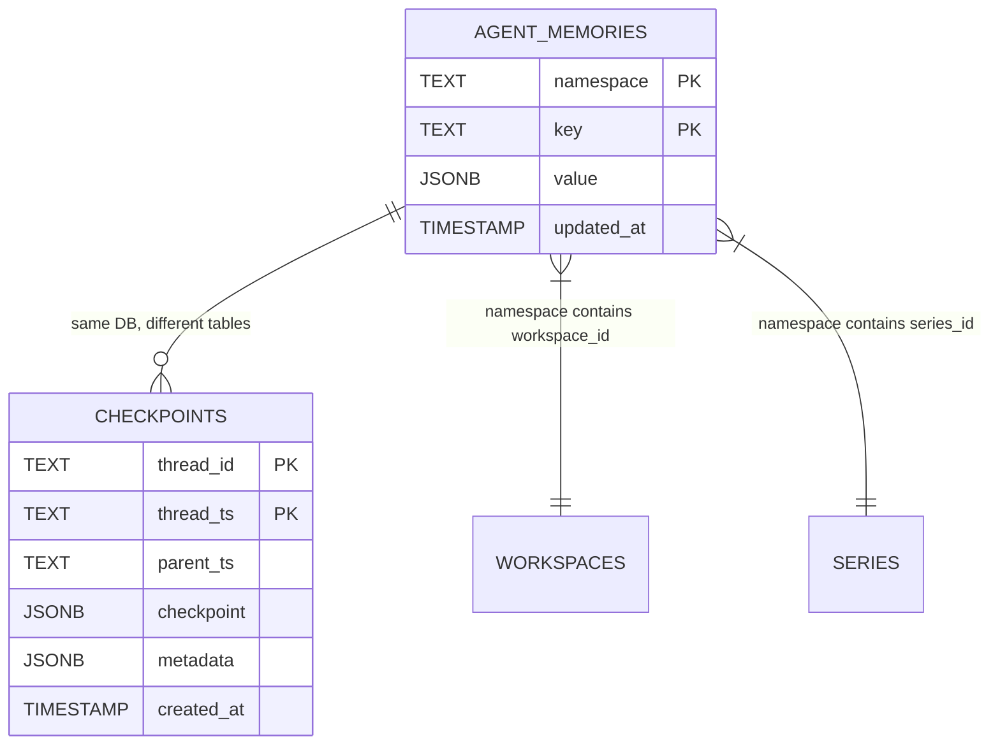
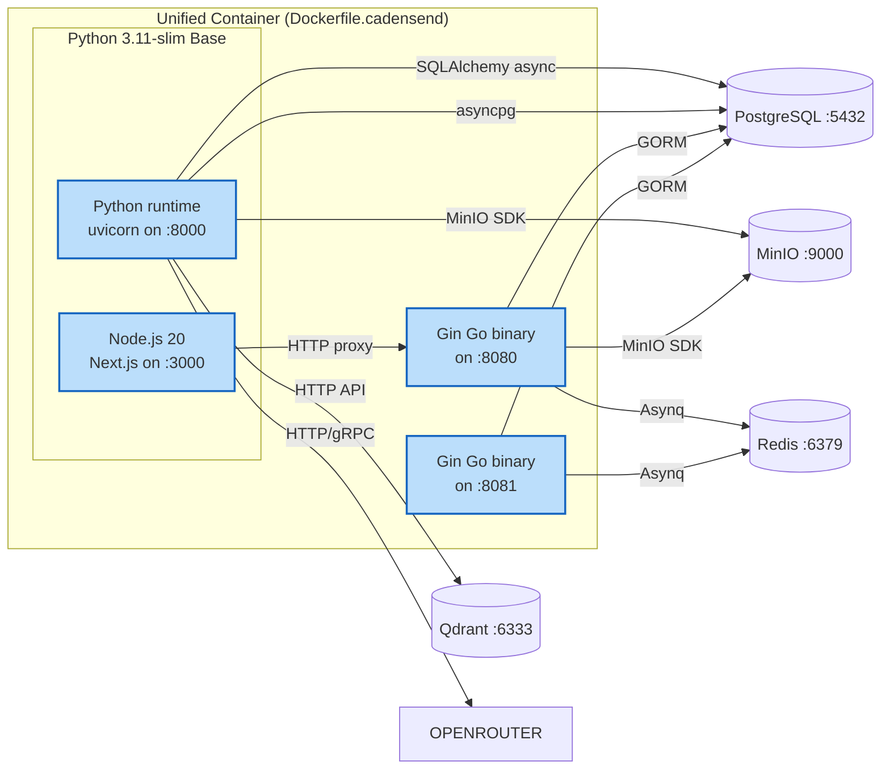

# AI Engine Architecture

This document describes the architecture of the Cadensend AI Engine, including the LangGraph agent workflow, memory systems, RAG pipeline, and integrations.

## Architecture Diagram

```mermaid
graph TB
    subgraph "Frontend Layer"
        WEB[Next.js Frontend<br/>Port 3000]
    end

    subgraph "Control Plane"
        API[Gin API Server<br/>Port 8080<br/>control-api]
        WORKER[Gin Worker<br/>Port 8081<br/>control-worker]
    end

    subgraph "AI Engine Plane"
        FASTAPI[FastAPI Server<br/>Port 8000<br/>ai-engine-api]
        AI_WORKER[AI Worker<br/>ai-engine-worker]

        subgraph "LangGraph Agent"
            AGENT[NewsletterAgent<br/>get_agent()]
            MODEL[ModelService<br/>OpenRouter LLM]
            TOOLS[NewsletterTools<br/>7 tools]

            subgraph "Agent Workflow Nodes"
                LOAD_MEM[load_memory]
                PLAN[plan]
                VALIDATE[validate_plan]
                RETRIEVE[retrieve_context]
                GENERATE[generate_issue]
                ANALYZE[analyze_coverage]
                VISUALS[generate_visuals]
                ASSEMBLE[assemble_issue]
                QUALITY[quality_check]
                REVISE[revise_issue]
                SAVE_MEM[save_memory]
            end

            subgraph "Tool Integrations"
                RET_TOOL[retrieve_context<br/>→ Qdrant]
                SEARCH_TOOL[search_sources<br/>→ Qdrant]
                VISUAL_TOOL[generate_visual<br/>→ LLM]
                SERIES_TOOL[get_series_context<br/>→ PostgreSQL]
                VALIDATE_TOOL[validate_plan]
                COST_TOOL[estimate_generation_cost]
                COVERAGE_TOOL[analyze_retrieval_coverage<br/>→ Qdrant]
            end
        end

        subgraph "Memory Systems"
            STM[Short-term Memory<br/>PostgresCheckpointBackend<br/>langgraph_checkpoints table]
            LTM[Long-term Memory<br/>LongTermMemoryStore<br/>agent_memories table]
        end
    end

    subgraph "Data Stores"
        POSTGRES[(PostgreSQL<br/>Relational Data)]
        QDRANT[(Qdrant<br/>Vector Store)]
        MINIO[(MinIO<br/>Object Storage)]
        REDIS[(Redis<br/>Job Queue)]
    end

    subgraph "External Services"
        OPENROUTER[OpenRouter API<br/>LLM Inference]
        BREVO[Brevo<br/>Email Delivery]
    end

    WEB -->|HTTP API| API
    WEB -->|HTTP API| FASTAPI

    API --> POSTGRES
    API --> REDIS
    WORKER --> POSTGRES
    WORKER --> REDIS

    FASTAPI --> AGENT
    AI_WORKER --> AGENT
    AGENT --> MODEL
    MODEL --> OPENROUTER

    AGENT --> STM
    AGENT --> LTM
    AGENT --> TOOLS

    LOAD_MEM --> |reads| LTM
    SAVE_MEM --> |writes| LTM
    AGENT --> |checkpoints| STM

    RET_TOOL --> QDRANT
    SEARCH_TOOL --> QDRANT
    COVERAGE_TOOL --> QDRANT
    SERIES_TOOL --> POSTGRES

    POSTGRES -->|stores| STM
    POSTGRES -->|stores| LTM
    POSTGRES -->|stores| BUSINESS_DATA
    QDRANT -->|stores| EMBEDDINGS
    MINIO -->|stores| SOURCE_DOCS
    MINIO -->|stores| ASSETS

    API -->|Asynq tasks| REDIS
    API --> BREVO

    classDef layer fill:#f9f9f9,stroke:#333,stroke-width:1px
    classDef agent fill:#e1f5fe,stroke:#0277bd,stroke-width:2px
    classDef store fill:#fff3e0,stroke:#ef6c00,stroke-width:2px
    classDef external fill:#f3e5f5,stroke:#6a1b9a,stroke-width:2px

    class AGENT,TOOLS,MODEL,LOAD_MEM,PLAN,VALIDATE,RETRIEVE,GENERATE,ANALYZE,VISUALS,ASSEMBLE,QUALITY,REVISE,SAVE_MEM agent
    class POSTGRES,QDRANT,MINIO,REDIS store
    class OPENROUTER,BREVO external
```

## LangGraph Agent Workflow

The newsletter generation workflow is a state machine with 12 nodes, bounded revision loops, and memory integration.

```mermaid
flowchart LR
    START([Start]) --> LOAD_MEM[load_memory<br/>Load long-term context]
    LOAD_MEM --> PLAN[plan<br/>Generate curriculum]
    PLAN --> VALIDATE[validate_plan<br/>Check constraints]
    VALIDATE --> RETRIEVE[retrieve_context<br/>RAG search Qdrant]
    RETRIEVE --> GENERATE[generate_issue<br/>LLM content generation]
    GENERATE --> ANALYZE[analyze_coverage<br/>Retrieval quality]
    ANALYZE --> VISUALS[generate_visuals<br/>Mermaid/D2 diagrams]
    VISUALS --> ASSEMBLE[assemble_issue<br/>Combine all parts]
    ASSEMBLE --> QUALITY[quality_check<br/>Citations & consistency]
    QUALITY --> SHOULD_REV{"Need<br/>revision?"}
    SHOULD_REV -->|Yes & attempts < 3| REVISE[revise_issue<br/>Improve content]
    REVISE --> QUALITY
    SHOULD_REV -->|No or max attempts| SAVE_MEM[save_memory<br/>Persist to LTM]
    SAVE_MEM --> END([End])

    style START fill:#c8e6c9
    style END fill:#c8e6c9
    style LOAD_MEM fill:#e1f5fe
    style SAVE_MEM fill:#e1f5fe
    style PLAN fill:#f3e5f5
    style GENERATE fill:#f3e5f5
    style REVISE fill:#fff3e0
```



### State Schema (`NewsletterState`)

| Field | Type | Description |
|-------|------|-------------|
| `messages` | `Sequence[BaseMessage]` | Conversation history (chat messages) |
| `brief` | `Dict[str, Any]` | Series brief with topic, goal, level, duration |
| `workspace_id` | `str` | Tenant workspace identifier |
| `series_id` | `Optional[str]` | Related series ID |
| `plan` | `Optional[Dict]` | Generated curriculum plan |
| `issues` | `List[Dict]` | Generated newsletter issues |
| `retrieved_context` | `List[Dict]` | RAG-retrieved passages with citations |
| `revision_count` | `int` | Number of revision loops (max 3) |
| `status` | `str` | Current workflow status |
| `error` | `Optional[str]` | Error message if any |
| `citations` | `List[Dict]` | Source citations |
| `visual_specs` | `List[Dict]` | Generated visual specifications |
| `memory_context` | `List[Dict]` | Long-term memory context |

### Memory Systems

#### Short-term Memory (Checkpoints)

- **Implementation**: `PostgresCheckpointBackend` in `checkpoint_backend.py`
- **Storage**: PostgreSQL table `langgraph_checkpoints`
- **Schema**:
  ```sql
  CREATE TABLE langgraph_checkpoints (
      thread_id TEXT NOT NULL,
      thread_ts TEXT NOT NULL,
      parent_ts TEXT,
      checkpoint JSONB NOT NULL,
      metadata JSONB,
      created_at TIMESTAMP WITH TIME ZONE DEFAULT NOW() NOT NULL,
      PRIMARY KEY (thread_id, thread_ts)
  );
  ```
- **Purpose**: Persists per-thread conversation state, allowing the agent to resume
- **Integration**: Compiled into the LangGraph with `checkpointer=PostgresCheckpointBackend()`

#### Long-term Memory

- **Implementation**: `LongTermMemoryStore` in `memory_store.py`
- **Storage**: PostgreSQL table `agent_memories`
- **Schema**:
  ```sql
  CREATE TABLE agent_memories (
      namespace TEXT NOT NULL,
      key TEXT NOT NULL,
      value JSONB NOT NULL,
      updated_at TIMESTAMP WITH TIME ZONE DEFAULT NOW() NOT NULL,
      PRIMARY KEY (namespace, key)
  );
  ```
- **Namespaces**: `("cadensend", "workspace", <workspace_id>, "series", <series_id>)`
- **Purpose**: Stores persistent memories about series briefs, writing style preferences, and plan history
- **Integration**: Used as `store` parameter when compiling the graph and as `checkpointer` store

### Tools

The agent binds these tools in `react_tools.py` (implementations in `NewsletterTools` / `PostgresSeriesCatalog`). Tenant ids are injected from graph state.

| Tool | Description | Integration |
|------|-------------|-------------|
| `retrieve_context` | Semantic search over ingested chunks; optional `source_id` | Qdrant with workspace/series filters |
| `search_sources` | Find matching source chunks (id, title, preview) | Qdrant vector search |
| `generate_visual` | Mermaid/D2 diagram spec | OpenRouter LLM |
| `get_series_context` | Series topic, cadence, send time, stored plan | PostgreSQL `series` |
| `list_series_sources` | Attached sources and ingest status | PostgreSQL `sources` |
| `get_issue_history` | Prior emails so later lessons do not repeat | PostgreSQL `issues` |
| `validate_plan` | Placeholder titles and missing objectives | Local validation |
| `analyze_retrieval_coverage` | `grounded` flag vs `COVERAGE_MIN_SCORE` | Qdrant + local scoring |

The writer has no send, ingest, web-search, or code-execution tools.

## RAG Pipeline

```mermaid
flowchart LR
    subgraph "Ingestion Pipeline"
        SOURCE[Source Content<br/>RSS, URLs, PDFs]
        CHUNK[Chunking<br/>CHUNK_SIZE=500]
        EMBED[Embedding Generation<br/>OpenRouter nvidia/nemotron-3-embed-1b]
        STORE[Qdrant Storage<br/>Vector Collection]

        SOURCE --> CHUNK
        CHUNK --> EMBED
        EMBED --> STORE
    end

    subgraph "Retrieval Pipeline"
        QUERY[User Query / Objective]
        QEMBED[Query Embedding]
        SEARCH[Qdrant Similarity Search]
        RESULTS[Retrieved Chunks<br/>with Scores]

        QUERY --> QEMBED
        QEMBED --> SEARCH
        SEARCH --> RESULTS
    end

    subgraph "Generation Pipeline"
        CONTEXT[Assembled Context]
        LLM[LLM (OpenRouter)]
        OUTPUT[Generated Newsletter Content]

        RESULTS --> CONTEXT
        CONTEXT --> LLM
        LLM --> OUTPUT
    end

    STORE -.-> SEARCH
    OUTPUT --> |Citations| RESULTS

    style SOURCE fill:#e8f5e9
    style STORE fill:#fff3e0
    style RESULTS fill:#e1f5fe
    style OUTPUT fill:#f3e5f5
```

### RAG Configuration

| Setting | Value | Description |
|---------|-------|-------------|
| `CHUNK_SIZE` | 500 | Characters per text chunk |
| `CHUNK_OVERLAP` | 80 | Overlap between adjacent chunks |
| `TOP_K_RETRIEVAL` | 20 | Internal retrieval default |
| `MAX_TOOL_TOP_K` | 8 | Cap on LLM-requested `top_k` |
| `MAX_QUERY_CHARS` | 500 | Cap on tool query length |
| `MAX_TOOL_RESULT_CHARS` | 8000 | Clip tool JSON returned to the model |
| `COVERAGE_MIN_SCORE` | 0.25 | Minimum avg score to mark retrieval `grounded` |
| `ISSUE_HISTORY_LIMIT` | 8 | Prior issues returned to the agent |
| `AGENT_SOURCE_LIST_LIMIT` | 20 | Sources listed per series |
| `MAX_TOOL_CALLS` | 10 | ReAct rounds before force-final |
| `MAX_REVISION_LOOPS` | 2 | Quality-gate revisions |
| `GENERATION_TIMEOUT_SECONDS` | 300 | Job deadline |
| `EMBEDDING_DIMENSION` | 2048 | Vector embedding dimensions |
| `EMBEDDING_BATCH_SIZE` | 20 | Batch size for embedding processing |

## API Routes

### Series Routes (`/v1/series`)

| Method | Path | Description |
|--------|------|-------------|
| POST | `/v1/series/brief` | Accept a series brief |
| POST | `/v1/series/{series_id}/plan` | Generate curriculum plan |
| GET | `/v1/series/{series_id}` | Get series details |
| POST | `/v1/series/{series_id}/activate` | Activate series |

### Issue Routes (`/v1/issues`)

| Method | Path | Description |
|--------|------|-------------|
| POST | `/v1/issues/{issue_id}/generate` | Generate newsletter issue with RAG citations |

### Source Routes (`/v1/sources`)

| Method | Path | Description |
|--------|------|-------------|
| POST | `/v1/sources` | Create a new source |

### Retrieval Routes (`/v1/retrieval`)

| Method | Path | Description |
|--------|------|-------------|
| POST | `/v1/retrieval/preview/{series_id}` | RAG retrieval preview |

### Health Route

| Method | Path | Description |
|--------|------|-------------|
| GET | `/healthz` | Health check |

## Data Model: Agent Memory



## Container Architecture


