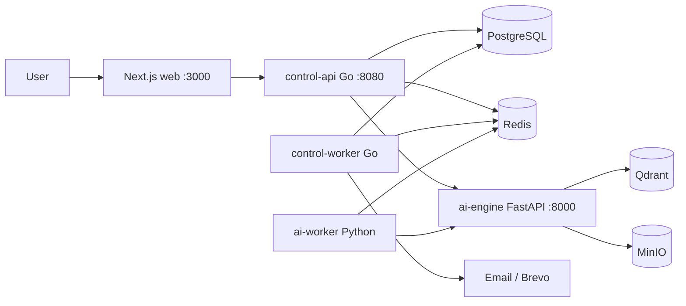
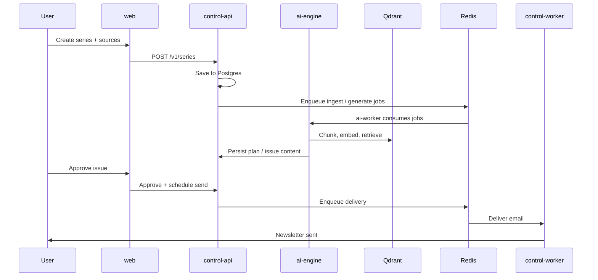

# Cadensend system architecture

High-level view of the monorepo and how services connect at runtime.

## System diagram



## Service roles

| Service | Path | Responsibility |
| --- | --- | --- |
| **web** | `frontend/web/` | Dashboard, series creation, settings, Cadensend AI chat |
| **control-api** | `backend/control-api/` | Auth, REST API, orchestration, SSE proxy to AI |
| **control-worker** | `backend/control-worker/` | Async jobs: email delivery, scheduling (Asynq) |
| **ai-engine** | `ai-service/ai-engine/api/` | LLM calls, plan/issue generation, RAG, assistant agent |
| **ai-worker** | `ai-service/ai-engine/workers/` | Background AI: ingestion, generation |

## Data stores

| Store | Use |
| --- | --- |
| **PostgreSQL** | Users, workspaces, series, issues, sources, LLM config, assistant threads |
| **Qdrant** | Vector search for RAG |
| **Redis** | Job queue (Asynq) |
| **MinIO** | PDFs, assets, generated files |

## Request flow (series → email)



## Repo layout

```
cadensend/
├── frontend/web/           # Next.js App Router UI
├── backend/
│   ├── control-api/        # Main REST API (Gin)
│   └── control-worker/     # Background worker
├── ai-service/ai-engine/
│   ├── api/                # FastAPI app
│   └── workers/            # Python job consumers
├── db/migrations/          # SQL migrations
├── packages/               # Shared contracts / email templates
└── docs/                   # Architecture and project docs
```

## Related docs

- [AGENTS.md](../AGENTS.md) — build commands and dev guidelines
- [ai-service/ai-engine/ARCHITECTURE.md](../ai-service/ai-engine/ARCHITECTURE.md) — LangGraph agent, RAG pipeline, AI internals
